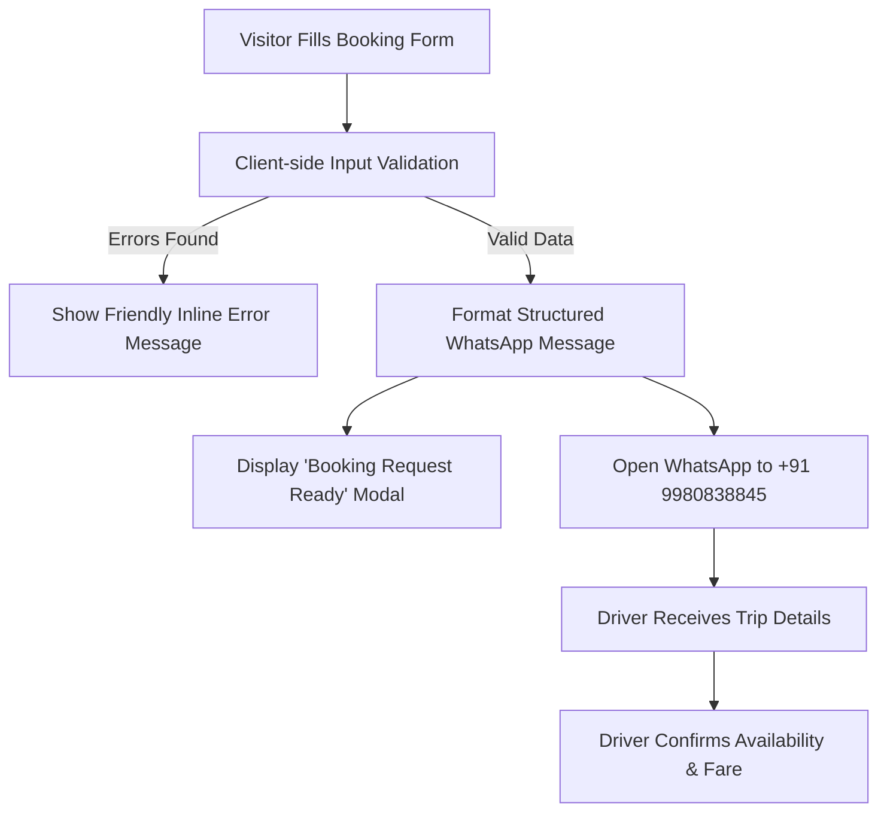

# SafeWay Travels — Official Web Platform

> **“25 Years of Comfort & Trust”**  
> A production-ready, trustworthy cab and travel booking website built for **SafeWay Travels**, an established Bengaluru-based travel service powered by 25 years of professional driving experience.

---

## 🌟 About SafeWay Travels

**SafeWay Travels** provides dependable local city rides, Kempegowda International Airport (BLR) transfers, outstation cab journeys, and multi-day round trips across Bengaluru, Karnataka, and South India.

Founded and operated on the foundation of **25 years of professional driving experience**, SafeWay Travels prioritizes:
- **Safety First**: Calm, defensive driving, zero rash overtaking, and adherence to traffic and highway guidelines.
- **Punctuality**: Punctual doorstep pickups and guaranteed on-time airport arrivals.
- **Transparent Pricing**: Honest quotes with upfront clarity on tolls, parking, and driver allowances. Zero surge-pricing games.
- **Comfortable AC Vehicles**: Sanitized, well-maintained vehicles tested for highway and city comfort.
- **Direct Communication**: Passengers talk directly with the experienced driver without platform commission markups or impersonal bots.

---

## 💼 Business Information

| Field | Detail |
| :--- | :--- |
| **Business Name** | SafeWay Travels |
| **Tagline** | *25 Years of Comfort & Trust* |
| **Location** | Bengaluru, Karnataka, India |
| **Phone** | [+91 99808 38845](tel:+919980838845) |
| **WhatsApp** | [+91 99808 38845](https://wa.me/919980838845) |
| **Email** | [ways63098@gmail.com](mailto:ways63098@gmail.com) |
| **Service Availability** | 24 Hours / 7 Days a Week |
| **Coverage Area** | Bengaluru City & South India Outstation (Karnataka, Tamil Nadu, Kerala, Andhra Pradesh) |

---

## 🚀 Key Features

1. **Zero-Friction WhatsApp Booking System**:
   - Customers select their travel details and instantly generate a formatted WhatsApp message.
   - Submissions open directly in WhatsApp with the driver at **+91 9980838845**.
   - No forced user registrations, passwords, OTPs, or third-party app installations.
   - **Booking Request Architecture**: Explicitly marks submissions as a "Booking Request" so passengers understand the driver will confirm vehicle availability and exact fares before departure.

2. **Mobile-First Responsive Design**:
   - **Sticky Mobile Action Bar**: Fixed bottom bar on phones offering 1-tap **Call Now**, **WhatsApp Us**, and **BOOK A CAB**.
   - Accessible slide-out hamburger navigation drawer.
   - Touch-friendly 48px+ targets, large legible typography, and zero horizontal scrolling on screens from 320px to 4K displays.

3. **Centralized Business Configuration (`js/config.js`)**:
   - All vehicle categories, pricing packages, contact numbers, email addresses, and reviews are stored in a clean JavaScript data structure.
   - The business owner or developer can edit any detail in seconds without editing HTML or CSS.

4. **Service Preselection Flow**:
   - Clicking *"Book Local Cab"*, *"Book Airport Transfer"*, *"Book Outstation Cab"*, or *"Book Round Trip"* smoothly scrolls down and automatically pre-selects that service in the booking form.

5. **Fleet Category Showcase**:
   - Clean, professional showcase for Sedan, SUV, Compact Hatchback, and Custom Group vehicles with seating and luggage capacity badges.
   - *"Select Vehicle"* button automatically populates the vehicle preference in the booking form.

6. **SEO & Performance Optimized**:
   - Semantic HTML5 with proper heading hierarchy (`h1`, `h2`, `h3`).
   - Open Graph tags and custom SVG favicon.
   - Schema.org `TaxiService` / `LocalBusiness` JSON-LD structured metadata.
   - High performance, lightweight vanilla code with zero heavy frameworks or dependencies.

7. **Accessibility (a11y)**:
   - Skip-to-content keyboard link.
   - Accessible ARIA labels on modals, navigation drawers, and accordions.
   - High color contrast compliant with WCAG guidelines.

---

## 🛠️ Technology Stack

- **Markup**: Semantic HTML5 with Schema.org JSON-LD structured data.
- **Styling**: Vanilla CSS3 (Custom CSS Properties, Flexbox, CSS Grid, Glassmorphism, Micro-animations).
  - *No TailwindCSS or heavy CSS frameworks used, adhering strictly to clean vanilla design system principles.*
- **Logic**: Vanilla JavaScript (ES6+ modular architecture).
- **Typography**: Google Fonts — [Plus Jakarta Sans](https://fonts.google.com/specimen/Plus+Jakarta+Sans) (Body & UI) & [Outfit](https://fonts.google.com/specimen/Outfit) (Headlines).
- **Icons**: Scalable inline SVGs (fast loading, resolution independent).
- **Hosting Compatibility**: 100% static — zero build step, instant deployment on GitHub Pages, Netlify, Vercel, or traditional cPanel/Apache/Nginx servers.

---

## 📱 How the WhatsApp Booking System Works

The booking system connects website visitors directly to the driver via WhatsApp in a frictionless flow:



### Generated WhatsApp Message Format:
```text
Hello SafeWay Travels,
I would like to book a cab.

Customer Details:
Name: [Customer Name]
Phone: [Customer Phone]
Email: [Customer Email, if provided]

Trip Details:
Service: [Local / Airport / Outstation / Round Trip]
Pickup: [Pickup Location in Bengaluru]
Drop: [Drop Location / Destination]
Date: [Travel Date]
Time: [Pickup Time]
Passengers: [Number of Passengers]
Vehicle Preference: [Sedan / SUV / Hatchback / Any]

Special Requests:
[e.g., Child seat, Extra luggage, Flight delay buffer]

Thank you.
```

---

## 💻 How to Run the Project Locally

Because SafeWay Travels uses pure vanilla web technologies, you do not need to install complex build tools.

### Option 1: Using Node.js (npx serve)
```powershell
# In the project root:
npx -y serve .
```
Visit `http://localhost:3000` (or the port indicated).

### Option 2: Using Python
```powershell
# In the project root:
python -m http.server 8080
```
Open `http://localhost:8080` in your web browser.

### Option 3: Direct File Opening
Double-click `index.html` to open it in any browser (Chrome, Edge, Firefox, Safari).

---

## ⚙️ How to Edit Business Information & Configuration

All core business data is centralized in **`js/config.js`**. You do not need to edit HTML layout files to update business content.

### 1. How to Edit Contact & Business Information
Open `js/config.js` and locate the `business` object:
```javascript
business: {
  name: "SafeWay Travels",
  tagline: "25 Years of Comfort & Trust",
  phoneRaw: "9980838845",          // Numbers only for tel: and WhatsApp
  phoneDisplay: "+91 99808 38845", // Formatted text for display
  whatsappRaw: "9980838845",
  whatsappDisplay: "+91 99808 38845",
  email: "ways63098@gmail.com",
  serviceHours: "24/7 Cab & Airport Transfer Service",
  city: "Bengaluru",
  state: "Karnataka",
  country: "India"
}
```

### 2. How to Edit Vehicle & Fleet Information
In `js/config.js`, modify the `fleet.vehicles` array. You can rename vehicles, change capacities, or link real vehicle photos:
```javascript
{
  id: "sedan",
  vehicleName: "Executive Sedan",        // e.g., "Swift Dzire / Toyota Etios"
  vehicleType: "Sedan (AC)",
  seatingCapacity: "4 Passengers + 1 Driver",
  luggageCapacity: "2 Large Bags + Hand Luggage",
  airConditioning: "Fully Air Conditioned",
  description: "Ideal for city commutes, business trips, and comfortable airport drops.",
  vehicleImage: "assets/images/fleet/my-car.jpg", // Add your photo path, or leave "" for polished placeholder
  statusText: "Available for Booking"
}
```

### 3. How to Edit Pricing Packages
In `js/config.js`, under `pricing.categories`, you can update package titles, descriptions, and fare badges:
```javascript
{
  id: "airport",
  title: "Airport Packages",
  subtitle: "BLR Kempegowda Airport",
  priceBadge: "Transparent Fixed Quotes", // Update to exact price e.g., "Starting from ₹899"
  pricingModel: "One-way Pickup or Drop",
  popular: true,
  features: [
    "Door-to-terminal pickup and drop",
    "Toll & parking clarity discussed upfront",
    "Flight delay assistance & driver coordination"
  ]
}
```

### 4. How to Edit Testimonials (Customer Reviews)
In `js/config.js`, under `testimonials.reviews`:
```javascript
{
  id: 1,
  author: "K. R. Narayanan",
  location: "Koramangala, Bengaluru",
  tripType: "Airport Transfer (Early Morning)",
  label: "Verified Customer Review", // Can be updated from "Sample Customer Review"
  stars: 5,
  content: "Booked an airport drop at 3:30 AM. SafeWay Travels arrived 10 minutes ahead of schedule..."
}
```

### 5. How to Replace Driver / Owner Photo
Place your image file in `assets/images/driver-photo.jpg`, then update `business.driverImage` in `js/config.js`:
```javascript
driverImage: "assets/images/driver-photo.jpg"
```

---

## 🌐 Deployment Instructions

This website is production-ready for instant static hosting:

### Deploying to GitHub Pages
1. Push the code to GitHub repository `stabin2008-ui/Sky_ways` on branch `main`.
2. Go to **Settings > Pages** in your GitHub repository.
3. Under **Branch**, select `main` and root `/ (root)`, then click **Save**.
4. Your site will be published at `https://stabin2008-ui.github.io/Sky_ways/`.

### Deploying to Netlify
1. Log in to [Netlify](https://app.netlify.com).
2. Drag and drop the project folder directly into the Netlify Sites dashboard, or link your GitHub repository `stabin2008-ui/Sky_ways`.
3. Your site deploys in seconds.

### Deploying to Vercel
```powershell
npm i -g vercel
vercel
```
Select default settings; the site will be deployed instantly.

### Deploying to Traditional Web Hosting (Hostinger, Bluehost, cPanel)
Upload the files (`index.html`, `css/`, `js/`, `assets/`, `favicon.svg`) directly into your server's `public_html/` folder.

---

## 🧪 Testing & Verification

An automated verification suite is included in `test_verification.js`. To run tests:
```powershell
node test_verification.js
```
The test suite validates:
- [x] All 16 critical assets, stylesheets, scripts, and images exist.
- [x] Config data integrity (Phone: `9980838845`, Email: `ways63098@gmail.com`, 25 Years of Experience).
- [x] Structured WhatsApp message formatting and URL encoding.
- [x] HTML semantic structure, required form element IDs, and modal bindings.
- [x] Client-side form validation (Indian phone format, travel dates, passenger counts).

---

## 📄 License & Attribution
&copy; 2026 **SafeWay Travels**. All rights reserved.  
Bengaluru, Karnataka, India.
